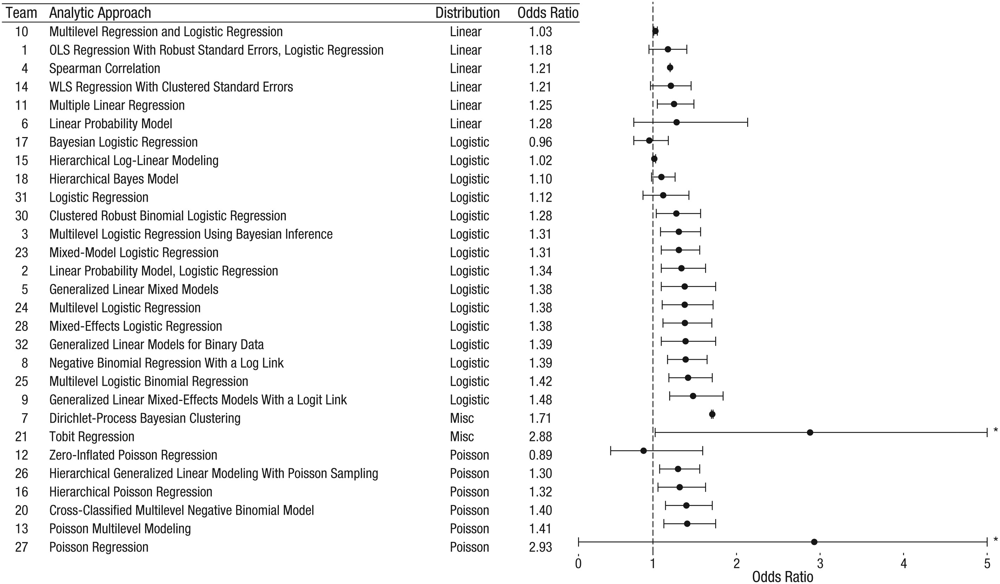

```{r setup, include=FALSE}
knitr::opts_chunk$set(message=FALSE,warning=FALSE)
```

# Intro {-}
Today, we will anecdotally look at how some topics from the Multivariate Verfahren lecture may be implemented in R and have a short motivation of how to improve interpretability for supervised learning models at the end.

Note that this lecture is only meant to

 - motivate you for what you can easily implement using R
 - reinforce some central learnings from the lecture
 
and the contents are *not relevant to the exam*.

## Setup {-}
We start by loading some basic packages and globally setting the ggplot theme so that our plots all look pretty.
```{r, message=FALSE}
library(readr)
library(readxl)
library(dplyr)
library(tidyr)
library(ggplot2)
library(plotly)
library(reshape)
library(patchwork)
library(RColorBrewer)
library(manipulate)
library(gridExtra)

theme_set(theme_bw())

```

----

# Basics of probability theory and linear algebra

## Linear Algebra

In R, we can simply define vectors via `c()`and matrices via `matrix()`.

Then:

 - matrix multiplication and summation are achieved via `+` and `%*%`
 - `t()`transposes a matrix and
 - `eigen()` gives us eigenvalues and eigenvectors while
 - `solve(a,b,...)` solves the equation `a %*% x = b` for `x`, where `b` can be either a vector or a matrix.
 
A separate HTML with examples is given [here](https://css18.github.io/linear-algebra.html).


----

## Probability and Simulation in R
Every distribution that $\textsf{R}$ handles has four functions. There is a root name, for example, the root name for the normal distribution is norm. This root is prefixed by one of the letters

  - $\mathrm{p}$ for "probability", the cumulative distribution function (c. d. f.)
  - $\mathrm{q}$ for "quantile", the inverse c.d.f.
  - $\mathrm{d}$ for "density", the density function (p. d. f.)
  - $\mathrm{r}$ for "random", a random variable having the specified distribution

Generally, we have the following options, with some additional ones provided by specific packages, such as `MASS::mvrnorm` for multivariate normal distribution:


```{r, echo=FALSE}

```

----

### Monte Carlo Integration

We can use these functions to perform MC integration (or integrate w.r.t. any number of probability) measures.

**Example: We can check that the integral over the standard normal density equals 1**

```{r}
# For absolute replicability, we need to set a seed
set.seed(123)
# sample from the uniform distribution
sample <- runif(10000000,-1000,1000)
# Perform MC integration for the standard normal density
# (should be equal to 1)
mean(2000*dnorm(sample))
```

**Example: We can compute the integral over some function w.r.t. the standard normal distribution**

```{r}
h <- function(X,Y){
  return(X^2+0.5*Y^2)
}
```
We can estimate the expectation $\mathbb{E}[h(X,Y)]$ for 
$$
h:\mathbb{R}\times\mathbb{R}\longrightarrow \mathbb{R},\quad (x,y)\mapsto x^2+\frac{1}{2}y^2
$$
and 
$$
(X,Y)^\top \sim N\left(\begin{pmatrix}1.5\\0.75\end{pmatrix},\begin{pmatrix}1\;\; 0.5\\0.5\;\;  1\end{pmatrix}\right)
$$
by running the following code:
```{r}
draws <- MASS::mvrnorm(1000000,mu = c(1.5,0.75),Sigma = matrix(c(1,0.5,0.5,1),nrow=2))

mean(h(c(draws[,1]),c(draws[,2])))
```


----

### Simulation

We can use these functions to simulate data that definitely meet certain probabilistic assumptions.

**For example, for linear regression:**

```{r}
# Simulation for a linear Model
X1 = rnorm(100,mean=50,sd=2)
X2 = sample(c(0,1),100,replace=TRUE)

intercept = 2
beta1 = 0.5
beta2 = 1.2
epsilon = rnorm(100,0,1)

Y = intercept + beta1*X1 + beta2*X2 + epsilon

# Check
coef(lm(Y~X1+X2))
```

----

# Getting non-simulated data
An excellent resource for finding data for playing around is [Kaggle](https://www.kaggle.com).

If you already have data, you can load them into R in different ways depending on the file type.

For example, the following imports all data we need for this lecture:

```{r}
pt <- readxl::read_excel("data/anomalies.xlsx")
Xeuro <- utils::read.table("data/europa.txt", header=T, row.names = 1)
load("data/MultiAnalyst.RData")
```

----

# Distance and similarity measures
*Note:* This section is based on exercises from last year's Multivariate Verfahren lecture.

## Plotting Euclidean, Manhattan, and Canberra distance matrices

First, let's define some vectors:


```{r}

# Vektoren definieren
s<-c(1, 1)
t<-c(0,5)
u<-c(2, 4)
v<-c(10, 15)
w<-c(12, 0)
```

Then we can plot just the vectors using the euclidean distance:

```{r}
# Als Matrix darstellen, wobei jede Spalte ein Vektor ist
vec_mat<-matrix(c(s, t, u, v, w), nrow=2)
colnames(vec_mat)<-c("s", "t", "u", "v", "w")
rownames(vec_mat)<-c("x", "y")

names_df<-data.frame("name" = c("s", "t", "u", "v", "w"))
vec_df<-as.data.frame(cbind(names_df, t(vec_mat)))
vec_df$name<-as.factor(vec_df$name)

# Vektoren plotten

vp<-ggplot(vec_df, aes(x = x, y = y))+geom_point(aes(color = name))+geom_segment(aes(xend=x, yend = y, color = name), x = 0, y = 0, size = 0.8)+
  xlab("x")+ylab("y")+theme_bw()+
  ggtitle("Graphic representation in x, y")+
  guides(color = guide_legend(title = "Vector name"))+
  theme(plot.title = element_text(hjust = 0.5))+
  xlim(c(0, 14))+ylim(c(0,15))

ggplotly(vp)
```

But we can also add heatmaps!

```{r, fig.width=10, fig.height=5}
# EUCLIDEAN

# Distanzmatrix

euc_dist<-as.matrix(round(dist(t(vec_mat), method = "euclidean", upper = TRUE, diag = TRUE),2))
euc_df<-melt(euc_dist)
colnames(euc_df)<-c("V1", "V2", "distance")

# Heatmap plotten

euc_hm<-ggplot(euc_df, aes(x = V1, y = V2, fill = distance))+
  geom_tile()+geom_text(aes(label = distance), color = "black", size = 5)+scale_fill_distiller(palette = "Blues", direction = 1)+xlab("Vector 1")+ylab("Vector 2")+
  ggtitle("Heatmap: Euclidean distance between vectors")+
  guides(fill = guide_legend(title = "Euclidean distance"))+
  theme(plot.title = element_text(hjust = 0.5))

euc_hm | vp


# MANHATTAN

# Distanzmatrix

man_dist<-as.matrix(round(dist(t(vec_mat), method = "manhattan", upper = TRUE, diag = TRUE),2))
man_df<-melt(man_dist)
colnames(man_df)<-c("V1", "V2", "distance")

# Heatmap plotten

man_hm<-ggplot(man_df, aes(x = V1, y = V2, fill = distance))+
  geom_tile()+geom_text(aes(label = distance), color = "black", size = 5)+scale_fill_distiller(palette = "Blues", direction = 1)+xlab("Vector 1")+ylab("Vector 2")+
  ggtitle("Heatmap: Manhattan distance between vectors")+
  guides(fill = guide_legend(title = "Manhattan distance"))+
  theme(plot.title = element_text(hjust = 0.5))

man_hm | vp

# CANBERRA

# Distanzmatrix

can_dist<-as.matrix(round(dist(t(vec_mat), method = "canberra", upper = TRUE, diag = TRUE),2))
can_df<-melt(can_dist)
colnames(can_df)<-c("V1", "V2", "distance")

# Heatmap plotten

can_hm<-ggplot(can_df, aes(x = V1, y = V2, fill = distance))+
  geom_tile()+geom_text(aes(label = distance), color = "black", size = 5)+scale_fill_distiller(palette = "Blues", direction = 1)+xlab("Vector 1")+ylab("Vector 2")+
  ggtitle("Heatmap: Canberra distance between vectors")+
  guides(fill = guide_legend(title = "Canberra distance"))+
  theme(plot.title = element_text(hjust = 0.5))

can_hm | vp

# BONUS: KOSINUS

# Definition Kosinusähnlichkeit

cosine_sim<-function(v1, v2){
  return(v1%*%v2/sqrt((v1%*%v1)*(v2%*%v2)))
}

cos_dist<-c()
for(i in 1:nrow(vec_df)){
  for(j in 1:nrow(vec_df))
    cos_dist<-append(cos_dist, cosine_sim(v1 = c(vec_df$x[i], vec_df$y[i]),
                                          v2 = c(vec_df$x[j], vec_df$y[j])))
}

# Kosinusdistanz = 1 - Kosinusähnlichkeit

cos_dist<-1-round(matrix(cos_dist, ncol = nrow(vec_df)),2)
colnames(cos_dist)<-c("s", "t", "u", "v", "w")
rownames(cos_dist)<-c("s", "t", "u", "v", "w")


cos_df<-melt(cos_dist)
colnames(cos_df)<-c("V1", "V2", "distance")

# Heatmap plotten

cos_hm<-ggplot(cos_df, aes(x = V1, y = V2, fill = distance))+
  geom_tile()+geom_text(aes(label = distance), color = "black", size = 5)+scale_fill_distiller(palette = "Blues", direction = 1)+xlab("Vector 1")+ylab("Vector 2")+
  ggtitle("Heatmap: Cosine distance between vectors")+
  guides(fill = guide_legend(title = "Cosine distance"))+
  theme(plot.title = element_text(hjust = 0.5))

cos_hm | vp
```


## Levenshtein-Distance for editing

Next, we want to compute the Levenshtein-Distance between the words
 „Katze“ und „Katz“, „Katze“ und „Katze“ und „Katze“ und „Katzen“.
 
 For this, we can use the function `adist()`!

```{r}

# Katze vs. Katze
cat("Distance(Katze, Katze): ", adist("Katze", "Katze")[1],
    "\nTransformation: ", attr(adist("Katze", "Katze", counts = TRUE), "trafos")[1])

# Katze vs Katz
cat("Distance(Katze, Katz): ", adist("Katze", "Katz")[1],
    "\nTransformation: ", attr(adist("Katze", "Katz", counts = TRUE), "trafos")[1])

# Katze vs Katzen
cat("Distance(Katze, Katzen): ", adist("Katze", "Katzen")[1],
    "\nTransformation: ", attr(adist("Katze", "Katzen", counts = TRUE), "trafos")[1])

# Katze vs Katez
cat("Distance(Katze, Katez): ", adist("Katze", "Katez")[1],
    "\nTransformation: ", attr(adist("Katze", "Katez", counts = TRUE), "trafos")[1])

```


### Autocorrect for one sentence

Next, let's consider Levenshtein-distance based autocorrect:

```{r}
original_satz<-"ihc fare noch Munchen und kaufen einn Bucch"

# Satz in Liste von Wörtern umwandeln
vektor_satz<-strsplit(original_satz, " ")[[1]]

# Ergebnis anzeigen
cat("Original sentence: ", original_satz, "\nVectorized sentence: ")
print(paste0(vektor_satz))

# Liste von Wörtern in Satz umwandeln
unvektor_satz<-paste(vektor_satz, collapse = ' ')
cat("Unvectorized sentence: ", unvektor_satz)

# Prüfen, dass der neue Satz dem ursprünglichen Satz entspricht
cat("Original sentence == Unvectorized sentence?: ", original_satz == unvektor_satz)

# Wortschatz
wortschatz<-c("ich", "du", "Arbeit", "Spaß", "Glück", "Familie", "liebe",
              "Reisen", "Frankreich", "Deutschland", "Kolumbien", "China",
              "Hund", "Katze", "Rose", "Schwein", "er", "sie", "es", "wir",
              "Frühstück", "München", "Berlin", "Hamburg", "fahren", "essen","trinken", "vergessen",
              "anfangen", "Wurst", "Breze", "Bier", "Rotterdam", "nach", "habe", "auf", "in",
              "und", "oder", "Frieden", "Buch", "kaufe", "Schildkröte", "Statistik", "fahre", "Mathematik",
              "Sozialwissenschaften", "Schloss", "Klavier", "Gitarre", "Urlaub", "mein", "meine",
              "ihre", "eure", "unsere", "seine", "sein", "Zeit", "Leben", "zu", "Vorsicht",
              "Bär")


# Heatmap anzeigen

distance_mat<-as.matrix(adist(vektor_satz, wortschatz))
rownames(distance_mat)<-vektor_satz
colnames(distance_mat)<-wortschatz

# als Dataframe für interaktive Heatmap anhand von geom_tile()

distance_df<-melt(distance_mat)
colnames(distance_df)<-c("sentence_word", "vocabulary_word", "distance")

# Definiere Schwellenwert
max_dist = 3

# Heatmap plotten
hm<-ggplot(distance_df[distance_df$distance<=max_dist,], aes(y=vocabulary_word, x= sentence_word, fill = distance))+
  geom_tile()+scale_fill_distiller(palette = "Blues", direction = 1)+xlab("Sentence word")+ylab("Vocabulary word")+
  ggtitle("Heatmap: Levenshtein distance between words")+
  guides(fill = guide_legend(title = "Levenshtein distance"))+
  theme(plot.title = element_text(hjust = 0.5))

# Interaktive Heatmap
ggplotly(hm)

# Aufgabe 2c)

# Autokorrektur-Funktion
autokorrektur<-function(satz, wortschatz=wortschatz){
# Satz in Liste von Wörtern umwandeln
vektor_satz<-strsplit(satz, " ")[[1]]
# Neue Liste von Wörtern initialisieren
neuer_vektor_satz<-c()
# Loop: in jedem Schritt das ähnlichste Wort aus W nehmen
  for(i in 1:length(vektor_satz)){
    neuer_vektor_satz[i] = wortschatz[which.min(adist(vektor_satz[i], wortschatz))]
  }
# Output Liste von Wörtern in einen Satz umwandeln
neuer_satz<-paste(neuer_vektor_satz, collapse = ' ')
# Output print
cat("Original sentence: ", satz, "\nNew sentence: ", neuer_satz)
}

# Beispiele:
autokorrektur("ihc fare noch Munchen und kaufen einn Bucch", wortschatz = wortschatz)
autokorrektur("ihc libe mainen Hund und meiner Katzep", wortschatz = wortschatz)
autokorrektur("ich heiße Karl und studiere Statistik", wortschatz = wortschatz)


# Aufgabe 2d)

# Ergebnisse kommentieren:
#Qualität der Ergebnisse: Sie sind nicht vielversprechend, denn nicht nur die Rechtschreibung
#spielt eine Rolle! auch die Reihenfolge und die Funktion jedes Wortes im Satz ist
# relevant. Die Wortschatzgröße ist auch von Bedeutung:
## -> Wortschatz zu klein/spezifisch: beschränkter Umfang
## -> Wortschatz zu groß: Wahrscheinlichkeit, das korrekte Wort zu finden, ist sehr gering

#Die Funktion könnte verbessert werden, indem die Wahrscheinlichkeiten eines Wortes anhand
#von seinem Kontext (Reihenfolge, Funktion des Wortes im Satz) und nicht nur anhand
#von Rechtschreibungsregeln geschätzt werden.

# Anhand von diesen Informationen Warscheinlichkeiten des nächsten Wortes schätzen.
```

### An easily digestible post about how text generation works:

Just in case you're curious:

[How to generate text: using different decoding methods for language generation with Transformers](https://huggingface.co/blog/how-to-generate)


## Anomalies using different distances

Thirty measurements of pressure and temperature were recorded in the anomalies file (saved in data frame `pt`). Several anomalies were detected. Now we wanted to detect future anomalies using various punch measurements.

```{r, echo=FALSE}
DT::datatable(pt, options = list(pageLength = 3))
```


```{r}
# We allready have the data in the data frame "pt"
pt_df<-as.data.frame(pt)
pt_df$messung<-as.factor(pt_df$messung)
pt_df$zustand<-as.factor(pt_df$zustand)

# Aufgabe 3b)

# Scatterplot
tp<-ggplot(pt_df, aes(x=druck, y=temperatur, col=zustand))+geom_point()+
  xlab("Pressure")+ylab("Temperature")+ggtitle("Temperature vs. Pressure")+
  scale_color_manual("State", breaks=c("normal", "anomaly"),
                     values=c("normal"="darkblue","anomaly"="darkred"))+
  guides(color = guide_legend(title = "State"))+theme_bw()+
  theme(plot.title = element_text(hjust = 0.5))
  
ggplotly(tp)

# Mittelwert der Daten, Point A und Point B mit gleicher Euklidischen Distanz
# Centroid
p_avg<-mean(pt_df$druck)
t_avg<-mean(pt_df$temperatur)
mean_point<-c(p_avg, t_avg)
# Cov Matrix
pt_cov<-cov(pt_df$druck, pt_df$temperatur)
p_var<-var(pt_df$druck)
t_var<-var(pt_df$temperatur)
cov_mat<-matrix(c(p_var, pt_cov, pt_cov, t_var), ncol = 2)
# Gewünschte Euklidische Distanz
d = 3
# Magnitude Centroid Vector
l = sqrt(mean_point %*% mean_point)
point_a<-c(p_avg*(1+d/l), t_avg*(1+d/l))
bx<-(p_avg - d*t_avg/l)
by<-(t_avg + d*p_avg/l)
point_b<-c(bx, by)

# Unkommentieren für die Skalar-Version für die Berechnung der Mahalanobis-Distanz
# md_numerator<-p_var*(point_a[2]-mean_point[2])^2 - 2*pt_cov*(point_a[1] - mean_point[1])*(point_a[2] - mean_point[2])+t_var*(point_a[1] - mean_point[1])^2
# md_denominator<-p_var*t_var-pt_cov^2
# md<-sqrt(md_numerator/md_denominator)
# md

# Ergebnisse graphisch darstellen

names<-c("centroid", "point_a", "point_b")

df_comparison<-data.frame("point_name" = names,
                          "x" = c(mean_point[1], point_a[1], point_b[1]),
                          "y" = c(mean_point[2], point_a[2], point_b[2]))

df_comparison$point_name<-as.factor(df_comparison$point_name)
df_comparison$zustand<-c("pending", "pending", "pending")
df_comparison$zustand<-as.factor(df_comparison$zustand)
plot<-tp+geom_point(data = df_comparison, aes(x=x, y = y, shape = point_name), size = 3.5)+
  geom_segment(data = df_comparison, aes(xend=x, yend = y, color = point_name), x = df_comparison[1,2], y = df_comparison[1,3])+
  scale_shape_manual("Point ID", breaks=c("centroid", "point_a", "point_b"),
                     values=c("centroid"=1,"point_a"= 2, "point_b" = 3))

plot 


# Funktion zur Berechnung der euklidischen Distanz von zwei Vektoren
euclidean<-function(v1, v2){
  return(dist(t(matrix(c(v1, v2), ncol=2))))
}

# Funktion zur Berechnung der Mahalanobis-Distanz von zwei Vektoren
mahalanobis_2d<-function(v1, v2, cov){
  right<-(1/(cov[1,1]*cov[2,2]-cov[1,2]^2))*matrix(c(cov[2,2],-cov[1,2], -cov[2,1], cov[1,1]), ncol=2) %*% t(t(v1-v2))
  return(sqrt(t(v1-v2) %*% right))
}

# BONUS: Funktion zur Berechnung der Kosinus-Ähnlichkeit von zwei Vektoren
cosine_sim<-function(v1, v2){
  return(v1%*%v2/sqrt((v1%*%v1)*(v2%*%v2)))
}

# Vergleichsfunktion
comparison<-function(v1, v2, cov){
  cat("Comparison for vectors: ","(", v1, ")"," and ", "(", v2, "):",
      "\nEuclidean distance: ", euclidean(v1, v2),
      "\nMahalanobis distance: ", mahalanobis_2d(v1, v2, cov),
      "\nCosine similarity: ", cosine_sim(v1, v2), " -> angle is: ", round(acos(cosine_sim(v1, v2))*180/pi, 2),
      "°")
}

comparison(point_a, mean_point, cov_mat)
comparison(point_b, mean_point, cov_mat)
comparison(point_a, point_b, cov_mat)


# Aufgabe 3c)


# Ursprünglicher Datensatz mit drei neuen Punkten erweitern: Punkt A, Punkt B und Datenschwerpunkt

new_df<-data.frame("messung" = c("centroid", "a", "b"), "druck" = c(mean_point[1], point_a[1], point_b[1]),
                   "temperatur" = c(mean_point[2], point_a[2], point_b[2]), "zustand" = c("tbd", "tbd", "tbd"))

full_df<-rbind(pt_df, new_df)
full_df$messung<-as.factor(full_df$messung)
full_df$zustand<-as.factor(full_df$zustand)

# Heatmap Euklidische-Distanz

euclidean_collection<-c()
cov_euc<-matrix(c(1, 0, 0, 1), ncol=2)
for(i in 1:nrow(full_df)){
  for(j in 1:nrow(full_df)){
    v1<-c(full_df$druck[i], full_df$temperatur[i])
    v2<-c(full_df$druck[j], full_df$temperatur[j])
    euclidean_collection<-append(euclidean_collection, mahalanobis_2d(v1, v2, cov_euc))
  }
}

euclidean_mat<-matrix(euclidean_collection, ncol=nrow(full_df))
colnames(euclidean_mat)<-full_df$messung
rownames(euclidean_mat)<-full_df$messung

# als Dataframe für interaktive Heatmap anhand von geom_tile()
euclidean_df<-melt(euclidean_mat)
colnames(euclidean_df)<-c("messung_a", "messung_b", "euclidean_a_to_b")

# Information über Beobachtungen hinzufügen
euc_df_1<-merge(x=euclidean_df, y= full_df[,c("messung", "zustand")], all.x = TRUE, by.x = "messung_a", by.y="messung", sort = FALSE)
euc_df_full<-merge(x=euc_df_1, y= full_df[,c("messung", "zustand")], all.x = TRUE, by.x = "messung_b", by.y="messung", sort = FALSE)

euc_df_full<-euc_df_full %>% select(messung_b, messung_a, euclidean_a_to_b, zustand.y, zustand.x)
colnames(euc_df_full)<-c("messung_a", "messung_b", "euclidean_a_to_b", "zustand_a", "zustand_b")
euc_df_full$vergleich<-if_else(euc_df_full$zustand_a == euc_df_full$zustand_b, if_else(euc_df_full$zustand_a == "anomaly", "A", "N"),"M")
euc_df_full$vergleich<-as.factor(euc_df_full$vergleich)

euc_max_dist = 100

# Heatmap plotten
euc_df_full$standard_distance<-(-min(euc_df_full$euclidean_a_to_b)+euc_df_full$euclidean_a_to_b)/(max(euc_df_full$euclidean_a_to_b)-min(euc_df_full$euclidean_a_to_b))


euc_hm<-ggplot(euc_df_full[euc_df_full$standard_distance<=euc_max_dist,], aes(x=messung_a, y= messung_b, fill = standard_distance))+
  geom_tile()+geom_text(aes(label = vergleich), color = "black", size = 2)+scale_fill_distiller(palette = "Blues", direction = 1)+xlab("Measurement A")+ylab("Measurement B")+
  ggtitle("Heatmap: Euclidean distance between measurements")+
  guides(fill = guide_legend(title = "Euclidean distance"))+
  theme(plot.title = element_text(hjust = 0.5))

ggplotly(euc_hm)

euc_df_full %>% group_by(vergleich) %>% summarize(mean_distance = mean(euclidean_a_to_b))

# Wiederholen mit Mahalanobis-Distanz

# Distanz-Matrix berechnen

mahalanobis_collection<-c()
for(i in 1:nrow(full_df)){
  for(j in 1:nrow(full_df)){
    v1<-c(full_df$druck[i], full_df$temperatur[i])
    v2<-c(full_df$druck[j], full_df$temperatur[j])
    mahalanobis_collection<-append(mahalanobis_collection, mahalanobis_2d(v1, v2, cov_mat))
  }
}

mahalanobis_mat<-matrix(mahalanobis_collection, ncol=nrow(full_df))
colnames(mahalanobis_mat)<-full_df$messung
rownames(mahalanobis_mat)<-full_df$messung

# als Dataframe für interaktive Heatmap anhand von geom_tile()
mahalanobis_df<-melt(mahalanobis_mat)
colnames(mahalanobis_df)<-c("messung_a", "messung_b", "mahalanobis_a_to_b")

# Information über Beobachtungen hinzufügen
maha_df_1<-merge(x=mahalanobis_df, y= full_df[,c("messung", "zustand")], all.x = TRUE, by.x = "messung_a", by.y="messung", sort = FALSE)
maha_df_full<-merge(x=maha_df_1, y= full_df[,c("messung", "zustand")], all.x = TRUE, by.x = "messung_b", by.y="messung", sort = FALSE)

maha_df_full<-maha_df_full %>% select(messung_b, messung_a, mahalanobis_a_to_b, zustand.y, zustand.x)
colnames(maha_df_full)<-c("messung_a", "messung_b", "mahalanobis_a_to_b", "zustand_a", "zustand_b")
maha_df_full$vergleich<-if_else(maha_df_full$zustand_a == maha_df_full$zustand_b, if_else(maha_df_full$zustand_a == "anomaly", "A", "N"),"M")
maha_df_full$vergleich<-as.factor(maha_df_full$vergleich)

maha_max_dist = 100

# Heatmap plotten
maha_df_full$standard_distance<-(-min(maha_df_full$mahalanobis_a_to_b)+maha_df_full$mahalanobis_a_to_b)/(max(maha_df_full$mahalanobis_a_to_b)-min(maha_df_full$mahalanobis_a_to_b))

maha_hm<-ggplot(maha_df_full[maha_df_full$standard_distance<=maha_max_dist,], aes(x=messung_a, y= messung_b, fill = standard_distance))+
  geom_tile()+geom_text(aes(label = vergleich), color = "black", size = 2)+scale_fill_distiller(palette = "Blues", direction = 1)+xlab("Measurement A")+ylab("Measurement B")+
  ggtitle("Heatmap: Mahalanobis distance between measurements")+
  guides(fill = guide_legend(title = "Mahalanobis distance"))+
  theme(plot.title = element_text(hjust = 0.5))

ggplotly(maha_hm)

# zur Info: Median-Distanz innerhalb der Zustandskategorien
euc_summary<-euc_df_full %>% group_by(vergleich) %>% summarize(median_distance = median(standard_distance))
euc_total<-data.frame("vergleich" = c("Gesamt"), "median_distance" = c(median(euc_df_full$standard_distance)))
euc_summary<-rbind(euc_summary, euc_total)
euc_summary$ratio_to_median<-euc_summary$median_distance/(median(euc_df_full$standard_distance))
euc_summary

maha_summary<-maha_df_full %>% group_by(vergleich) %>% summarize(median_distance = median(standard_distance))
maha_total<-data.frame("vergleich" = c("Gesamt"), "median_distance" = c(median(maha_df_full$standard_distance)))
maha_summary<-rbind(maha_summary, maha_total)
maha_summary$ratio_to_median<-maha_summary$median_distance/(median(maha_df_full$standard_distance))
maha_summary


```


# Unsupervised learning
*Note:* This section is based on exercises from last year's Multivariate Verfahren lecture.


Next, we look at data which contains data on n = 24 European countries and for which the following variables were collected: `ober` (surface area in km2), `einw` (population in millions), `brut` (GDP per capita in $) and `arbl` (unemployment rate in %)).

```{r, echo=FALSE}
DT::datatable(Xeuro, options = list(pageLength = 3))
```

We want to cluster this data using both hierarchical and k-means clustering!

## Hierarchical Clustering using `hclust()`

```{r}
# Standardisieren der Daten
euroscaled <- scale(Xeuro, scale=TRUE, center=TRUE)
# checken, ob Daten wirklich Standardisiert sind (mean = 0, var = 1)
round(colMeans(euroscaled),10)
var(euroscaled)


# b) ----------------------------------------------------------------------
# quadrierte euklidische Distanzen
dist_eucl2 <- dist(euroscaled, method="euclidean")^2

# Single Linkage mit allen Kovariablen und eukl. Distanz
single_linkage <- hclust(dist_eucl2, method="single")


# c) ----------------------------------------------------------------------
# Zentroid mit allen Kovariablen und eukl. Distanz
centroid <- hclust(dist_eucl2, method="centroid")


# d) ----------------------------------------------------------------------
# Mahalanobis-Distanz
S <- var(euroscaled)
n <- nrow(euroscaled)
dist_mahal <- matrix(NA, nrow=n, ncol=n)
for(i in 1:n){
  dist_mahal[i,] <- mahalanobis(euroscaled, euroscaled[i,], S)
}
rownames(dist_mahal) <- colnames(dist_mahal) <- rn <- rownames(euroscaled)
dist_mahal <- as.dist(dist_mahal)

# Complete Linkage mit allen Kovariablen und Mahalanobis-Distanz
complete_linkage <- hclust(dist_mahal, method="complete")
```

```{r, fig.width=12, fig.height=8}
# e) ----------------------------------------------------------------------
library(factoextra)
grid.arrange(
  fviz_dend(single_linkage) + ggtitle("Single Linkage - Dendrogramm"),
  fviz_dend(centroid) + ggtitle("Zentroid - Dendrogramm"),
  fviz_dend(complete_linkage) + ggtitle("Complete Linkage - Dendrogramm"),
  ncol = 3
)
```

## k-means using the `cluster`package
```{r, fig.width=12, fig.height=8}

# f) ----------------------------------------------------------------------
# Das package cluster enthaelt verschiedene Clustering-Verfahren (sowohl hierarchische
# als auch Partitionsverfahren)
library(cluster)
help(kmeans)
# Partitionsverfahren: Es muss Datenmatrix (standardisiert) und Anzahl der Cluster
# uebergeben werden (Einen ersten Anhaltspunkt zur Clusteranzahl koennen hierarchische
# Verfahren liefern.)

# kmeans-Clustering mit allen Kovariablen, 100 zufaellige Startpartitionen
set.seed(356)

km_list <- list()
wss <- numeric()

for (k in 1:10){
  km_list[[k]] <- kmeans(x=euroscaled, centers=k, iter.max=100, nstart=100)
  wss[k] <- sum(km_list[[k]]$withinss)
}

par(mfrow = c(1,1))
plot(1:10, wss, type="b", xlab="Number of Clusters", ylab="Within groups sum of squares")
# => drei oder sechs Cluster erscheinen nach dem "elbow criterion" geeignet

#Damit erhaelt man folgende Cluster:
(km3.cl <- cbind(as.character(rn[order(km_list[[3]]$cluster)]), sort(km_list[[3]]$cluster)))
(km6.cl <- cbind(as.character(rn[order(km_list[[6]]$cluster)]), sort(km_list[[6]]$cluster)))

# Graphisch dargestellt (immer nur bzgl. 2 Variablen - deshalb gibt es auch Ueberlappungen)

# für k = 3
grid.arrange(
  fviz_cluster(km_list[[3]], data = euroscaled[, c(1,2)], ggtheme = theme_bw()),
  fviz_cluster(km_list[[3]], data = euroscaled[, c(1,3)], ggtheme = theme_bw()),
  fviz_cluster(km_list[[3]], data = euroscaled[, c(1,4)], ggtheme = theme_bw()),
  fviz_cluster(km_list[[3]], data = euroscaled[, c(2,3)], ggtheme = theme_bw()),
  fviz_cluster(km_list[[3]], data = euroscaled[, c(2,4)], ggtheme = theme_bw()),
  fviz_cluster(km_list[[3]], data = euroscaled[, c(3,4)], ggtheme = theme_bw()),
  nrow = 3, ncol = 2
)

# für k = 6
grid.arrange(
  fviz_cluster(km_list[[6]], data = euroscaled[, c(1,2)], ggtheme = theme_bw()),
  fviz_cluster(km_list[[6]], data = euroscaled[, c(1,3)], ggtheme = theme_bw()),
  fviz_cluster(km_list[[6]], data = euroscaled[, c(1,4)], ggtheme = theme_bw()),
  fviz_cluster(km_list[[6]], data = euroscaled[, c(2,3)], ggtheme = theme_bw()),
  fviz_cluster(km_list[[6]], data = euroscaled[, c(2,4)], ggtheme = theme_bw()),
  fviz_cluster(km_list[[6]], data = euroscaled[, c(3,4)], ggtheme = theme_bw()),
  nrow = 3, ncol = 2
)


# g) Vorbereitungen ------------------------------------------------------
# Zur Visualisierung beschraenken wir uns auf die Variablen arbl und brut

# quadrierte euklidische Distanzen
dist_eucl2_ab <- dist(euroscaled[,3:4], method="euclidean")^2

# Mahalanobis-Distanz
S <- var(euroscaled[,3:4])
n <- nrow(euroscaled[,3:4])
dist_mahal_ab <- matrix(NA, nrow=n, ncol=n)
for(i in 1:n){
  dist_mahal_ab[i,] <- mahalanobis(euroscaled[,3:4], euroscaled[i,3:4], S)
}
rownames(dist_mahal_ab) <- colnames(dist_mahal_ab) <- rownames(euroscaled[,3:4])
dist_mahal_ab <- as.dist(dist_mahal_ab)


# g) Auf Basis von factoextra ---------------------------------------------
# Single Linkage mit arbl und brut, quadratischer eukl. Distanz
plot_single_linkage <- function(k) {
  clust <- hcut(dist_eucl2_ab, k = k, hc_func = "hclust", hc_method = "single")
  fviz_cluster(clust, data = euroscaled[,3:4], ggtheme = theme_bw(), main = "Single Linkage")
}
# Zentroid mit arbl und brut, quadratischer eukl. Distanz
plot_centroid <- function(k) {
  clust <- hcut(dist_eucl2_ab, k = k, hc_func = "hclust", hc_method = "centroid")
  fviz_cluster(clust, data = euroscaled[,3:4], ggtheme = theme_bw(), main = "Centroid")
}
# Complete Linkage mit arbl und brut, Mahalanobis-Distanz
plot_complete_linkage <- function(k) {
  clust <- hcut(dist_mahal_ab, k = k, hc_func = "hclust", hc_method = "complete")
  fviz_cluster(clust, data = euroscaled[,3:4], ggtheme = theme_bw(), main = "Complete Linkage")
}
# k-means mit arbl und brut
plot_k_means <- function(k) {
  clust <- kmeans(x=euroscaled[,3:4], centers=k, iter.max=20, nstart=10)
  fviz_cluster(clust, data = euroscaled[,3:4], ggtheme = theme_bw(), main = "k Means")
}


### Graphischer Vergleich
plot_cluster_k <- function(k) {
  grid.arrange(plot_single_linkage(k), plot_centroid(k), plot_complete_linkage(k), plot_k_means(k))
}

#manipulate(plot(1:5, cex=size), size = slider(0.5,10,step=0.5))
#manipulate(
#  plot_cluster_k(k), k = slider(2, 10, initial = 4)
#)

```


# Supervised learning

## Logistic regression, LDA and QDA

This section is predominantly based on [this Rpubs page](https://rpubs.com/uky994/600156).
Note that **Rpubs** is also a nice resource for examples of R applications.

### The Stock Market Data
We will begin by examining some numerical and graphical summaries of the `Smarket` data, which is part of the `ISLR` library. This data set consists of percentage returns for the S&P 500 stock index over 1, 250 days, from the beginning of 2001 until the end of 2005. For each date, we have recorded the percentage returns for each of the five previous trading days, `Lag1` through `Lag5`. We have also recorded `Volume` (the number of shares traded on the previous day, in billions), `Today` (the percentage return on the date in question) and `Direction` (whether the market was `Up` or `Down` on this date).

```{r}
library(ISLR)
str(`Smarket`)
pairs(`Smarket`)
```

The `cor()` function produces a matrix that contains all of the pairwise correlations among the predictors in a data set. The first command below gives an error message because the `Direction` variable is qualitative.

```{r,error=TRUE}
cor(`Smarket`)
cor(`Smarket` [,-9])
```

As one would expect, the correlations between the lag variables and today's returns are close to zero. In other words, there appears to be little correlation between today's returns and previous days' returns. The only substantial correlation is between `Year` and `Volume`. By plotting the data we see that `Volume` is increasing over time. In other words, the average number of shares traded daily increased from 2001 to 2005.

```{r}
attach(`Smarket`)
plot(Volume)
```

### Logistic Regression
Next, we will fit a logistic regression model in order to predict `Direction`
using `Lag1` through `Lag5` and `Volume`. The `glm()` function fits generalized linear models, a class of models that includes logistic regression. The syntax of the `glm()` function is similar to that of `lm()`, except that we must pass in the argument `family=binomial` in order to tell `R` to run a logistic regression rather than some other type of generalized linear model.

```{r}
glm.fits=glm(Direction~Lag1+Lag2+Lag3+Lag4+Lag5+Volume, data=Smarket,family=binomial )
summary (glm.fits)
```

The smallest p-value here is associated with `Lag1`. The negative coefficient for this predictor suggests that if the market had a positive return yesterday, then it is less likely to go up today. However, at a value of 0.15, the p-value is still relatively large, and so there is no clear evidence of a real association between `Lag1` and `Direction`.

We use the `coef()` function in order to access just the coefficients for this fitted model. We can also use the `summary()` function to access particular aspects of the fitted model, such as the p-values for the coefficients.

```{r}
coef(glm.fits)
summary(glm.fits)$coef
summary (glm.fits)$coef[,4]
```

The `predict()` function can be used to predict the probability that the market will go up, given values of the predictors. The `type="response"` option tells R to output probabilities of the form $P(Y = 1|X)$, as opposed to other information such as the logit. If no data set is supplied to the `predict()` function, then the probabilities are computed for the training data that was used to fit the logistic regression model. Here we have printed only the first ten probabilities. We know that these values correspond to the probability of the market going up, rather than down, because the `contrasts()` function indicates that `R` has created a dummy variable with a 1 for `Up`.

```{r}
glm.probs=predict(glm.fits,type="response")
glm.probs [1:10]
contrasts(Direction)
```

In order to make a prediction as to whether the market will go up or down on a particular day, we must convert these predicted probabilities into class labels, `Up` or `Down`. The following two commands create a vector of class predictions based on whether the predicted probability of a market increase is greater than or less than 0.5.

```{r}
glm.pred=rep("Down" ,1250)
glm.pred[glm.probs >.5]="Up"
```

The first command creates a vector of 1,250 `Down` elements. The second line transforms to Up all of the elements for which the predicted probability of a market increase exceeds 0.5. Given these predictions, the `table()` function can be used to produce a confusion matrix in order to determine how many observations were correctly or incorrectly classified.

```{r}
table(glm.pred ,Direction )
```
```{r}
(507+145) /1250
```
```{r}
mean(glm.pred==Direction )
```

The diagonal elements of the confusion matrix indicate correct predictions, while the off-diagonals represent incorrect predictions. Hence our model correctly predicted that the market would go up on 507 days and that it would go down on 145 days, for a total of 507 + 145 = 652 correct predictions. The `mean()` function can be used to compute the fraction of days for which the prediction was correct. In this case, logistic regression correctly predicted the movement of the market 52.2 % of the time.

At first glance, it appears that the logistic regression model is working a little better than random guessing. However, this result is misleading because we trained and tested the model on the same set of 1,250 observations. In other words, 100 ??? 52.2 = 47.8 % is the training error rate. As we
have seen previously, the training error rate is often overly optimistic-it tends to underestimate the test error rate. In order to better assess the accuracy of the logistic regression model in this setting, we can fit the model using part of the data, and then examine how well it predicts the held out data. This will yield a more realistic error rate, in the sense that in practice we will be interested in our model's performance not on the data that we used to fit the model, but rather on days in the future for which the market's movements are unknown.

To implement this strategy, we will first create a vector corresponding to the observations from 2001 through 2004. We will then use this vector to create a held out data set of observations from 2005.

```{r}
train=(Year<2005)
Smarket.2005= Smarket[!train ,]
Direction.2005= Direction[!train]
dim(Smarket.2005)
Direction.2005= Direction[!train]
```

The object `train` is a vector of 1,250 elements, corresponding to the observations in our data set. The elements of the vector that correspond to observations that occurred before 2005 are set to `TRUE`, whereas those that correspond to observations in 2005 are set to `FALSE`. The object `train` is a Boolean vector, since its elements are `TRUE` and `FALSE`. Boolean vectors can be used to obtain a subset of the rows or columns of a matrix. For instance, the command ``Smarket`[train,]` would pick out a submatrix of the stock market data set, corresponding only to the dates before 2005, since those are the ones for which the elements of `train` are `TRUE`. The `!` symbol can be used to reverse all of the elements of a Boolean vector. That is, `!train` is a vector similar to `train`, except that the elements that are `TRUE` in `train` get swapped to `FALSE` in `!train`, and the elements that are `FALSE` in `train` get swapped to `TRUE` in `!train`. Therefore, ``Smarket`[!train,]` yields a submatrix of the stock market data containing only the observations for which train is `FALSE`-that is, the observations with dates in 2005. The output above indicates that there are 252 such observations.

We now fit a logistic regression model using only the `subset` of the observations that correspond to dates before 2005, using the subset argument. We then obtain predicted probabilities of the stock market going up for each of the days in our test set-that is, for the days in 2005.

```{r}
glm.fits=glm(Direction~Lag1+Lag2+Lag3+Lag4+Lag5+Volume, data=Smarket,family=binomial ,subset=train)
glm.probs=predict (glm.fits,Smarket.2005, type="response")
```

Notice that we have trained and tested our model on two completely separate data sets: training was performed using only the dates before 2005, and testing was performed using only the dates in 2005. Finally, we compute the predictions for 2005 and compare them to the actual movements of the market over that time period.

```{r}
glm.pred=rep("Down",252)
glm.pred[glm.probs >.5]="Up"
table(glm.pred ,Direction.2005)
mean(glm.pred==Direction.2005)
mean(glm.pred!=Direction.2005)
```

The `!=` notation means *not equal to*, and so the last command computes the test set error rate. The results are rather disappointing: the test error rate is 52 %, which is worse than random guessing! Of course this result is not all that surprising, given that one would not generally expect to be able to use previous days' returns to predict future market performance. (After all, if it were possible to do so, then the authors of this book would be out striking it rich rather than writing a statistics textbook.)

We recall that the logistic regression model had very underwhelming pvalues associated with all of the predictors, and that the smallest p-value, though not very small, corresponded to `Lag1`. Perhaps by removing the variables that appear not to be helpful in predicting `Direction`, we can obtain a more effective model. After all, using predictors that have no relationship with the response tends to cause a deterioration in the test error rate (since such predictors cause an increase in variance without a corresponding decrease in bias), and so removing such predictors may in turn yield an improvement. Below we have refit the logistic regression using just `Lag1` and `Lag2`, which seemed to have the highest predictive power in the original logistic regression model.

```{r}
glm.fits=glm(Direction~Lag1+Lag2 ,data=Smarket ,family=binomial,subset=train)
glm.probs=predict(glm.fits,Smarket.2005, type="response")
glm.pred=rep("Down",252)
glm.pred[glm.probs >.5]="Up"
table(glm.pred ,Direction.2005)
mean(glm.pred==Direction.2005)
106/(106+76)
```

Now the results appear to be a little better: 56% of the daily movements have been correctly predicted. It is worth noting that in this case, a much simpler strategy of predicting that the market will increase every day will also be correct 56% of the time! Hence, in terms of overall error rate, the logistic regression method is no better than the na?ive approach. However, the confusion matrix shows that on days when logistic regression predicts an increase in the market, it has a 58% accuracy rate. This suggests a possible trading strategy of buying on days when the model predicts an increasing market, and avoiding trades on days when a decrease is predicted. Of course one would need to investigate more carefully whether this small improvement was real or just due to random chance.

Suppose that we want to predict the returns associated with particular values of `Lag1` and `Lag2`. In particular, we want to predict `Direction` on a day when `Lag1` and `Lag2` equal 1.2 and 1.1, respectively, and on a day when they equal 1.5 and ???0.8. We do this using the `predict()` function.

```{r}
predict(glm.fits,newdata =data.frame(Lag1=c(1.2 ,1.5),Lag2=c(1.1,-0.8) ),type="response")
```


#### ROC

Thus far, we have chosen the threshold $0.5$. To check if there is a better option, we can look at the ROC using the `pROC` package.

```{r}
library(pROC)

roc_curve <- roc(Smarket$Direction,predict(glm.fits, newdata=Smarket, type = "response")) 

roc_data <- data.frame(
    threshold = roc_curve$thresholds,
    specificity = roc_curve$specificities,
    sensitivity = roc_curve$sensitivities
)

# Plot using ggplot2 and add threshold values
ggplot(roc_data, aes(x = 1 - specificity, y = sensitivity)) +
    geom_line(color = "blue") +
    geom_abline(linetype = "dashed", color = "gray") +
    labs(title = "ROC Curve", x = "1 - Specificity", y = "Sensitivity") +
    theme_minimal() +
    geom_text(aes(label = round(threshold, 2)),data=roc_data[seq(1,nrow(roc_data),by=50),], size = 3, vjust = -1.5)+
    geom_point(aes(x = 1 - specificity, y = sensitivity),data=roc_data[seq(1,nrow(roc_data),by=50),], size = 1)

```

Here, the blue like gives the ROC and the black dots indicate different threshold values.

Is this a good model? What do you think?

### Linear Discriminant Analysis
Now we will perform LDA on the `Smarket` data. In `R`, we fit an LDA model using the `lda()` function, which is part of the `MASS` library. Notice that the `lda()` syntax for the function is identical to that of `lm()`, and to that of `glm()` except for the absence of the family option. We fit the model using only the observations before 2005.

```{r}
library(MASS)
lda.fit=lda(Direction~Lag1+Lag2 ,data=`Smarket` ,subset=train)
lda.fit
plot(lda.fit)
```

The LDA output indicates that $\hat{\pi}_1$ = 0.492 and $\hat{\pi}_2$ = 0.508; in other words, 49.2 % of the training observations correspond to days during which the market went down. It also provides the group means; these are the average of each predictor within each class, and are used by LDA as estimates of $\mu_k$. These suggest that there is a tendency for the previous 2 days' returns to be negative on days when the market increases, and a tendency for the previous days' returns to be positive on days when the market declines. The *coefficients of linear discriminants* output provides the linear combination of `Lag1` and `Lag2` that are used to form the LDA decision rule. In other words, these are the multipliers of the elements of X = *x* in (4.19). If ???0.642?`Lag1`???0.514?`Lag2` is large, then the LDA classifier will predict a market increase, and if it is small, then the LDA classifier will predict a market decline. The plot() function produces plots of the *linear discriminants*, obtained by computing ???0.642 ? `Lag1` ??? 0.514 ? `Lag2` for each of the training observations.

The `predict()` function returns a list with three elements. The first element, `class`, contains LDA's predictions about the movement of the market. The second element, `posterior`, is a matrix whose *k*th column contains the posterior probability that the corresponding observation belongs to the *k*th class, computed from (4.10). Finally, `x` contains the linear discriminants, described earlier.

```{r}
lda.pred=predict (lda.fit , Smarket.2005)
names(lda.pred)
```

As we observed in Section 4.5, the LDA and logistic regression predictions are almost identical.
```{r}
lda.class=lda.pred$class
table(lda.class ,Direction.2005)
mean(lda.class==Direction.2005)
```

Applying a 50 % threshold to the posterior probabilities allows us to recreate the predictions contained in `lda.pred$class`.

```{r}
sum(lda.pred$posterior[,1]>=.5)
sum(lda.pred$posterior[,1]<.5)
```

Notice that the posterior probability output by the model corresponds to the probability that the market will decrease:

```{r}
lda.pred$posterior[1:20,1]
lda.class[1:20]
```

If we wanted to use a posterior probability threshold other than 50 % in order to make predictions, then we could easily do so. For instance, suppose that we wish to predict a market decrease only if we are very certain that the market will indeed decrease on that day-say, if the posterior probability is at least 90%.

```{r}
sum(lda.pred$posterior[,1]>.9)
```

No days in 2005 meet that threshold! In fact, the greatest posterior probability of decrease in all of 2005 was 52.02 %.

### Quadratic Discriminant Analysis
We will now fit a QDA model to the `Smarket` data. QDA is implemented in R using the qda() function, which is also part of the `MASS` library. The syntax is identical to that of `lda()`.

```{r}
qda.fit=qda(Direction~Lag1+Lag2 ,data=Smarket ,subset=train)
qda.fit
```

The output contains the group means. But it does not contain the coefficients of the linear discriminants, because the QDA classifier involves a quadratic, rather than a linear, function of the predictors. The `predict()` function works in exactly the same fashion as for LDA.

```{r}
qda.class=predict(qda.fit ,Smarket.2005)$class
table(qda.class ,Direction.2005)
mean(qda.class==Direction.2005)
```

Interestingly, the QDA predictions are accurate almost 60 % of the time, even though the 2005 data was not used to fit the model. This level of accuracy is quite impressive for stock market data, which is known to be quite hard to model accurately. This suggests that the quadratic form assumed by QDA may capture the true relationship more accurately than the linear forms assumed by LDA and logistic regression. However, we recommend evaluating this method's performance on a larger test set before betting that this approach will consistently beat the market!

### Plotting LDA and QDA using the `klaR` package

```{r}
library(klaR)
partimat(Direction ~ Lag1 + Lag2, data=Smarket, method="lda", subset=train)
partimat(Direction ~ Lag1 + Lag2, data=Smarket, method="qda", subset=train)
```

## Interpretability for supervised learning models

In the `CompInt package [@CompInt], I am implementing a framework for interpretable and comparable effect size measures and visualization techniques.

The basic idea is that most statistical models may be written as
$$\mathbb{E}[Y\vert X]=f_\theta(X)\;,$$
where $Y$ denotes the target and $X$ the vector of regressors.

To obtain a specific quantity, we need to choose:

  - a regressor of interest $X_I$
  - an area/set of values over which we want to average $\mathbb{X}$
  - an assumption regarding the dependence structure of the regressors. We can choose from:
```{r, echo=FALSE}

```


Then, the most important quantities are

  - generalized marginal effects: $gME(\theta)=\int_\mathbb{X} \frac{\delta}{\delta X_I}f_\theta(x)d\mu_X(x)$
  - individual expectations: $IE(\theta)=\int_\mathbb{X} f_\theta(x)d\mu_X(x)$
  - contrasts: difference between individual expectations for differents sets $\mathbb{X}$.


Note that these quantities are functions of the parameter vector $\theta$!
To obtain point estimates and uncertainty, we may take the mean/median and highest density interval/quantile.

--> We can use MC integration to get our quantities!


### Motivation for application: A Multi-analyst study

[@Silberzahn] Asked 29 teams of analysts the same Question: *Are soccer referees more likely to give red cards to dark-skin-toned players than to light-skin-toned players?*
The results of this multi-analyst study were reported as follows:

```{r, echo=FALSE}

```

Note that even though different distributional assumptions are listed, any model that was able to produce an OR value had to be based on a logistic (or, in this case, due to the [rare disease assumption](https://en.wikipedia.org/wiki/Rare_disease_assumption), poisson) model!


#### Q1.a)
Load the 2 data sets saved in `MultiAnalyst.RData` and take a look at them. How would you answer the above research question?

```{r}
library(CompInt)
library(ggpubr)
library(ggridges)
library(ggeasy)
library(fastDummies)
library(HDInterval)
library(ggdist)
```

::: {#Table1}
The original Silberzahn data:
:::

```{r, echo=FALSE}
DT::datatable(SilberzahnData, options = list(pageLength = 3))
```


#### Different types of models were fit
You can try fitting the following 3 types of glms to appropriately answer the question *using ONLY* `rating_mean` as the single regressor:

  - Linear
  - Poisson
  - Logistic

```{r}
SilberzahnData$redCard_rate<-SilberzahnData$redCards/SilberzahnData$games
Slinear <- glm(redCard_rate~rating_mean,data=SilberzahnData,family = gaussian())
Spoisson<-glm(redCards~rating_mean,offset = log(games),data=SilberzahnData,family = poisson())
Slogistic<-glm(redCards~rating_mean,data=SilberzahnBinary,family=binomial())
```

#### How can we compare these models?
Next, try making lineplots of the point predictions as a function of rating_mean value between 0 and 1. How would you interpret this plot?

```{r}
newdata = data.frame(rating_mean=seq(0,1,by=0.001),games=1)

Spreds <- data.frame(x=rep(newdata$rating_mean,3),
                   Distribution=as.factor(c(rep("Normal(linear)",nrow(newdata)),
                                            rep("Poisson(exponential)",nrow(newdata)),
                                            rep("Bernoulli (logistic)",nrow(newdata)))),
                   Prediction=c(predict(Slinear, newdata, type="response"),
                                predict(Spoisson, newdata, type="response"),
                                predict(Slogistic, newdata, type="response"))
                    )
Spreds %>%
  ggplot(aes(x=x,y=Prediction,color=Distribution))+geom_line()+
  labs(y="Predicted number of red cards given per game",x="Average skin tone rating",color="Distribution Assumption")
```

#### IEs (some version of predictions)
Using the function `get_IE` with arguments `Slinear,reg_of_interest = "rating_mean",` `integration = assumption2(all_empirical(newdata=mutate(Slinear$data,rating_mean= ???))),` `ndraws=1000,seed=123`, you can calculate 1000 draws from the the constrast-quantity given by the difference between the conditional expectation given a mean rating of 1 and a mean rating of 0. How would you interpret the mean of these draws?

```{r, message=FALSE}
linear_gME <- get_IE(Slinear,reg_of_interest = "rating_mean",integration = assumption2(all_empirical(newdata=mutate(Slinear$data,rating_mean=1))),ndraws=1000,seed=123)-get_IE(Slinear,reg_of_interest = "rating_mean",integration = assumption2(all_empirical(newdata=mutate(Slinear$data,rating_mean=0))),ndraws=1000,seed=123)
  
poisson_gME <- get_IE(Spoisson,reg_of_interest = "rating_mean",integration = assumption2(all_empirical(newdata=mutate(Spoisson$data,rating_mean=1))),ndraws=1000,seed=123)-get_IE(Spoisson,reg_of_interest = "rating_mean",integration = assumption2(all_empirical(newdata=mutate(Spoisson$data,rating_mean=0))),ndraws=1000,seed=123)


logistic_gME <- get_IE(Slogistic,reg_of_interest = "rating_mean",integration = assumption2(all_empirical(newdata=mutate(Slogistic$data,rating_mean=1))),ndraws=1000,seed=123)-get_IE(Slogistic,reg_of_interest = "rating_mean",integration = assumption2(all_empirical(newdata=mutate(Slogistic$data,rating_mean=0))),ndraws=1000,seed=123)
```


#### Generalized Marginal Effects
For each model, you can plot gMEs as a density plot, using `stat_slabinterval`, with point estimate and uncertainty reason next to

  - the point estimate and CI-borders for the beta-coefficient as well as 
  - the point estimate and CI-borders for the Odds Ratio
  
What can we learn from this plot?

```{r, message=FALSE}
linCI <- unname(c(confint(Slinear)[2,1],coef(Slinear)[2],confint(Slinear)[2,2]))
poiCI <- unname(c(confint(Spoisson)[2,1],coef(Spoisson)[2],confint(Spoisson)[2,2]))
logisticCI <- unname(c(confint(Slogistic)[2,1],coef(Slogistic)[2],confint(Slogistic)[2,2]))

df <- data.frame(effect=rep(c(rep("gME",1000),rep("Odds Ratio",3),rep("Point Estimate",3)),3),
                   Distribution=as.factor(c(rep("Normal(linear)",1006),
                                            rep("Poisson(exponential)",1006),
                                            rep("Bernoulli (logistic)",1006))),
                  x=c(linear_gME,c(NA,NA,NA),linCI,
                      poisson_gME,exp(poiCI),poiCI,
                      logistic_gME,exp(logisticCI),logisticCI
                ))


df_gME <- df %>% filter(effect == "gME")
df_expCI <- df %>% filter(effect == "Odds Ratio")
df_rawCI <- df %>% filter(effect == "Point Estimate")

# Plotting
ggarrange(
ggplot(df_gME, aes(x=x,y=Distribution)) + xlab("") + 
  stat_halfeye(alpha=0.75,point_interval = "mean_hdi",fill="lightblue")+
  facet_wrap(effect~.) + ylab("Model"),
ggplot(df_expCI, aes(x = x, y = Distribution)) + xlab("") + 
  stat_pointinterval(point_interval = "median_hdi", .width=c(0,1)) +
  geom_point(shape=15, color="lightblue") +
  facet_wrap(effect~.) + ylab("") + theme(axis.text.y = element_blank()) +
  annotate("text", x = 1.35, y=2, label = "Not Applicable"),  # Add points
ggplot(df_rawCI, aes(x = x, y = Distribution)) + xlab("") + 
  stat_pointinterval(point_interval = "median_hdi", .width=c(0,1)) +
  geom_point(shape=15, color="lightblue") +
  facet_wrap(effect~.) + ylab("") + theme(axis.text.y = element_blank()), # Add points
nrow=1,widths = c(10,5,5))
```


----

### More application to simulated medical data
Lastly, we can think about the kinds of data where the choice of Assumption 1-3 would really make a difference.

The following simulates a data set that contains

  - *outcome* as target variable
  - *treatment* as regressor of interest
  - *sex (male/female)* as one (of the) additional regressor(s)

and has a structure for which the choice of assumption makes a difference!

Then, we can generate IEs and gMEs under *each assumption* separately for patients of the female and male sex. How would you interpret these plots?

#### Simulation:

```{r}

# Set seed for reproducibility
#set.seed(123)
set.seed(5050)


# Number of observations
n <- 1000

# Simulate treatment variable (0 or 1)
treatment <- sample(0:1, n, replace = TRUE)

# Simulate sex variable (0 or 1)
sex <- sample(0:1, n, replace = TRUE)

# Simulate age variable (assuming a normal distribution with mean 40 and sd 10)
age <- rnorm(n, mean = 40, sd = 10)


condition <- ifelse(age > 60 & sex == 1, 1, 0)
swap_indices <- sample(n, size = n/10)  # Swap 10% of the values
condition[swap_indices] <- 1 - condition[swap_indices]

# Simulate outcome variable based on specified effects
# Formula: outcome = intercept + treatment_effect * treatment + sex_effect * sex + age_effect * age + error
intercept <- -1  # Adjust as needed
treatment_effect <- .5
sex_effect <- -0.2
age_effect <- -0.05
condition_effect <- 1

# Error term with normal distribution
error <- rnorm(n, mean = 0, sd = 1)

# Calculate outcome variable
outcome <- intercept + treatment_effect * treatment + sex_effect * sex + age_effect * age + condition*condition_effect + error

# Convert outcome to binary (0 or 1) based on a threshold (e.g., median)
threshold <- median(outcome)
outcome <- as.numeric(outcome > threshold)


# Create data frame
simulated_data <- data.frame(outcome = outcome, treatment = as.factor(treatment), sex, age, condition)
```


#### Generation of draws:

```{r}
mod<-glm(outcome~treatment+age+sex+condition, data = simulated_data,family = binomial())

gME_1_fem <- get_gME(mod, integration = assumption1(all_empirical(newdata=mod$data[which(mod$data$sex==0),])), reg_of_interest = "treatment",ndraws=2000 ,seed = 321)
gME_2_fem <- get_gME(mod, integration = assumption2(all_empirical(newdata=mod$data[which(mod$data$sex==0),])), reg_of_interest = "treatment",ndraws=2000 ,seed = 321)
gME_3_fem <- get_gME(mod, integration = assumption3(all_empirical(newdata=mod$data[which(mod$data$sex==0),])), reg_of_interest = "treatment",ndraws=2000 ,seed = 321)

gME_1_m <- get_gME(mod, integration = assumption1(all_empirical(newdata=mod$data[which(mod$data$sex==1),])), reg_of_interest = "treatment",ndraws=2000 ,seed = 321)
gME_2_m <- get_gME(mod, integration = assumption2(all_empirical(newdata=mod$data[which(mod$data$sex==1),])), reg_of_interest = "treatment",ndraws=2000 ,seed = 321)
gME_3_m <- get_gME(mod, integration = assumption3(all_empirical(newdata=mod$data[which(mod$data$sex==1),])), reg_of_interest = "treatment",ndraws=2000 ,seed = 321)

IE_1_fem <- get_IE(mod, integration = assumption1(all_empirical(newdata=mod$data[which(mod$data$sex==0),])), reg_of_interest = "treatment",ndraws=2000 ,seed = 321)
IE_2_fem <- get_IE(mod, integration = assumption2(all_empirical(newdata=mod$data[which(mod$data$sex==0),])), reg_of_interest = "treatment",ndraws=2000 ,seed = 321)
IE_3_fem <- get_IE(mod, integration = assumption3(all_empirical(newdata=mod$data[which(mod$data$sex==0),])), reg_of_interest = "treatment",ndraws=2000 ,seed = 321)

IE_1_m <- get_IE(mod, integration = assumption1(all_empirical(newdata=mod$data[which(mod$data$sex==1),])), reg_of_interest = "treatment",ndraws=2000 ,seed = 321)
IE_2_m <- get_IE(mod, integration = assumption2(all_empirical(newdata=mod$data[which(mod$data$sex==1),])), reg_of_interest = "treatment",ndraws=2000 ,seed = 321)
IE_3_m <- get_IE(mod, integration = assumption3(all_empirical(newdata=mod$data[which(mod$data$sex==1),])), reg_of_interest = "treatment",ndraws=2000 ,seed = 321)
```

#### Plotting:

```{r}
var_names_gME <- apply(do.call(expand.grid,list(c("gME"),c(1,2,3),c("m","fem"))),1,function(x)paste(x,collapse="_"))

PlotData_gME <- data.frame(
  Q = character(0),  # Initialize columns as character vectors
  Assumption = numeric(0),
  Sex = character(0),
  Values = numeric(0)
)
for (var_name in var_names_gME) {
  components <- unlist(strsplit(var_name, "_"))  # Split variable name
  values <- as.vector(get(var_name))  # Get values from the variable name
  
  # Append to the data frame
  PlotData_gME <- rbind(PlotData_gME, data.frame(
    Q = components[1],
    Assumption = paste0("A" ,components[2]),
    Sex = paste0(components[3],"ale"),
    Values = values
  ))
}


var_names_IE <- apply(do.call(expand.grid,list(c("IE"),c(1,2,3),c("m","fem"))),1,function(x)paste(x,collapse="_"))

PlotData_IE <- data.frame(
  Q = character(0),  # Initialize columns as character vectors
  Assumption = numeric(0),
  Sex = character(0),
  Values = numeric(0),
  treatment=numeric(0)
)
for (var_name in var_names_IE) {
  components <- unlist(strsplit(var_name, "_"))  # Split variable name
  values_0 <- as.vector(as.data.frame(t(get(var_name)))$treatment0)
  values_1 <- as.vector(as.data.frame(t(get(var_name)))$treatment1)
  
  # Append to the data frame
  PlotData_IE <- rbind(PlotData_IE, data.frame(
    Q = components[1],
    Assumption = paste0("A" ,components[2]),
    Sex = paste0(components[3],"ale"),
    Values = values_0,
    treatment =0
  ))
  
  PlotData_IE <- rbind(PlotData_IE, data.frame(
    Q = components[1],
    Assumption = paste0("A" ,components[2]),
    Sex = paste0(components[3],"ale"),
    Values = values_1,
    treatment = 1
  ))
}


ggarrange(ggplot(PlotData_IE, aes(x = Values, y = as.factor(ifelse(treatment==1,"Treatment","Placebo")),fill=as.factor(Sex))) +
            stat_halfeye(alpha=0.75,point_interval = "mean_hdi")+
            scale_x_continuous(labels = scales::percent)+
            coord_flip()+theme_bw()+ggtitle("")+ylab("")+#scale_fill_manual(values=c("slategray","darkblue"))+
            facet_wrap(.~Assumption)+xlab("individualized expectation")+labs(fill="Sex")+
            theme(plot.margin = unit(c(-1,0.2,-1,0.2), 'lines')),
          ggplot(PlotData_gME, aes(x = Values,fill=as.factor(Sex))) +
            stat_halfeye(alpha=0.75,point_interval = "mean_hdi")+
            scale_x_continuous(labels = scales::percent)+
            theme_bw()+ggtitle("")+easy_remove_y_axis()+#scale_fill_manual(values=c("slategray","darkblue"))+
            facet_grid(Assumption~.)+xlab("generalized marginal effect")+labs(fill="Sex")+
            theme(panel.grid.major = element_blank(), panel.grid.minor = element_blank(),panel.background = element_blank())+
            theme(plot.margin = unit(c(-0.5,0.2,0,0.2), 'lines')),
          nrow=2,common.legend = TRUE,heights = c(4,3.2),legend="right")

```


# Info on writing an R package

.... [R Packages (2e) by Hadley Wickham and Jennifer Bryan](https://r-pkgs.org)

# References {-}
